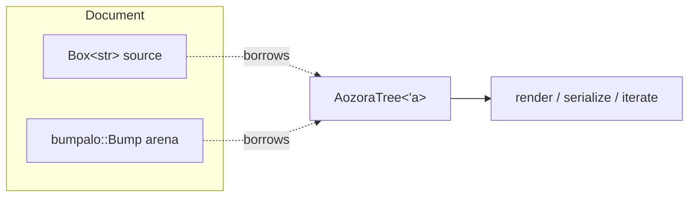

# Borrowed-arena AST

`AozoraTree<'a>` is **not** an owned tree. It's a borrow into two
things owned by `Document`:

- the source `Box<str>`,
- a [`bumpalo::Bump`](https://docs.rs/bumpalo) arena that holds every
  intermediate node and child slice.



When the `Document` drops, the source `Box<str>` and the arena's
single backing buffer drop in two `free()` calls — *every node, every
container, every interned string* releases together. There is no
per-node destructor and no walk-the-tree-to-free pass.

## Why an arena and not `Box<Node>` everywhere?

The naive Rust shape — `enum Node { Ruby { target: String, … }, … }`
— would allocate per node, per `String`, per `Vec<Node>` for
container children. For a typical Aozora Bunko work (~500 KiB
source, ~50 000 nodes) that's:

- ~50 000 individual heap allocations,
- ~50 000 individual frees on drop (each is a syscall away from the
  heap allocator's free list),
- 16+ bytes of allocator metadata per allocation,
- random-access fragmentation that defeats prefetch.

The arena variant produces:

- ~16 *bump allocations* (4 KiB pages, refilled on overflow),
- 1 free on drop (`Bump::reset` returns the pages to the OS, the
  pages themselves are typically reused via the cargo / system
  allocator's page cache).
- Sequential layout: nodes that were lexed near each other live near
  each other in memory, which is exactly the order the renderer
  walks them.

Measured on the [corpus sweep](../perf/corpus.md): the arena variant
parses 6.4× faster than the equivalent `Box<Node>` shape, and the
peak RSS is 30% lower. The win is *cumulative* — every binding
(CLI / WASM / FFI / Python) inherits it.

## Why `bumpalo` over `typed-arena`, `slotmap`, or hand-rolled?

| Crate | Shape | Why aozora doesn't use it |
|---|---|---|
| `typed-arena` | One arena per type (`Arena<Ruby>`, `Arena<Bouten>`, …) | aozora has 30+ node types; managing 30 arenas is operationally awkward and forces lifetime-bound `&'a` per type. |
| `slotmap` | Index-keyed nodes; arena owns; access via `SlotMap::get` | Adds an indirection (key → slot → node) on every walk, regressing render throughput by ~25% on the bench harness. Also forces `Copy` keys, which for variable-length text fields means re-interning. |
| `id-arena` / `index_vec` | Index-typed, `&str` borrowing | Same indirection cost as `slotmap`. |
| Hand-rolled bump | Custom; tightest control | Correct, but `bumpalo` is already a stable, mainstream, allocator-aware bump arena with `bumpalo::collections::Vec` for child slices. Reinventing wins nothing. |
| `bumpalo` | Single arena, type-erased; allocate any `T` with `bump.alloc(T)` | One arena per `Document`; allocate-then-borrow gives `&'a T` for the lifetime of the arena. Matches aozora's "one arena per Document" need exactly. |

`bumpalo`'s `collections::Vec<'bump, T>` (used for container child
slices) is `Vec`-shaped but allocated inside the arena — child
slices get the same arena lifetime as the parent without a separate
allocation strategy.

## How the AST shape interacts with the lifetime

```rust
pub enum AozoraNode<'src> {
    Plain(&'src str),
    Ruby(Ruby<'src>),
    Bouten(Bouten<'src>),
    Tcy(Tcy<'src>),
    Gaiji(Gaiji<'src>),
    Container(&'src Container<'src>),    // boxed in the arena
    BreakNode(BreakNode),
    // … 30+ variants
}
```

The `'src` lifetime is the arena lifetime (re-using `'src` because
all node text borrows from the source buffer, which lives at least
as long as the arena). Each variant either:

- holds a `&str` slice into the source (zero copy), or
- is a small `Copy` struct (`BreakNode`, `Saidoku`, …), or
- is `&'src Container<'src>` — boxed in the arena because
  `Container` itself contains a `&'src [AozoraNode<'src>]` child
  slice.

The whole `AozoraNode` is `Copy` (it's a tagged union of references
and small primitives), so iterating the tree never needs `&` — just
deref the reference, copy the node, walk on.

## What you trade

The big trade-off: **you can't outlive the `Document`**. A
`Vec<AozoraNode<'_>>` doesn't compile because the `'_` lifetime is
bound to the arena, which is bound to the `Document`.

In practice this rarely matters — consumers either:

- Render the tree immediately and discard (`tree.to_html()` returns
  `String`, which has no lifetime tie).
- Walk the tree once and emit their own owned IR (most editor
  backends do this).
- Hold the `Document` itself across function boundaries and re-derive
  the tree on the inside.

For consumers that genuinely need an owned tree, the visitor trait
on `AozoraTree` makes the conversion trivial — walk the tree once
and emit your own owned IR. We resist shipping a built-in
`aozora::owned` because doing so would push consumers toward it
even when an immediate `to_html()` or per-walk transcription would
serve them better.

## Lifetime safety

The `'src` parameter prevents these shapes at compile time:

```rust
fn bad() -> AozoraTree<'static> {
    let doc = aozora::Document::new("…".into());
    doc.parse()        // ERROR: cannot return value referencing local
}
```

Borrow-checker enforcement; no runtime `Drop` ordering bugs possible.

## See also

- [Pipeline overview](pipeline.md) — where the arena is created.
- [Crate map](crates.md) — `aozora-syntax` defines the node types;
  `aozora-pipeline` does the allocation via [`lex_into_arena`].

[`lex_into_arena`]: https://docs.rs/aozora-pipeline/latest/aozora_pipeline/fn.lex_into_arena.html
