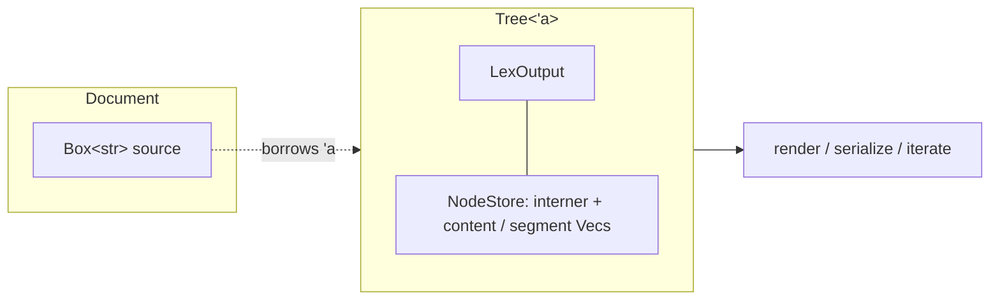

# Owned AST & NodeStore

`Tree<'a>` is a **view** over an owned, lifetime-free parse result. Its
`'a` lifetime tracks only one thing — the borrow of the source string
owned by `Document`. The AST data itself is owned outright by an
`LexOutput`, so it carries no arena lifetime and is `Send + Sync`.

- `Document` owns the source `Box<str>` (and a `Copy` diagnostic
  policy). It holds no parse state.
- `Document::parse` runs the owned lex pipeline and returns a
  `Tree<'_>` that owns its `LexOutput` and borrows only `&self`'s
  source.
- Every variable-length payload — interned strings, `Content` runs,
  `Segment` slices — lives in a flat `NodeStore` addressed by small
  `u32` handles, not behind pointers into an arena.


```mermaid
flowchart LR
    subgraph Document
        src["Box&lt;str&gt; source"]
    end
    subgraph Tree["Tree&lt;'a&gt;"]
        out["LexOutput"]
        store["NodeStore: interner + content / segment Vecs"]
        out --- store
    end
    walk["render / serialize / iterate"]

    src -.borrows 'a.-> Tree
    Tree --> walk
```

When the `Tree` drops, the `NodeStore`'s `Vec`s and the interner drop in
a handful of `free()` calls — *every node, every container, every
interned string* releases together. There is no per-node destructor and
no walk-the-tree-to-free pass. When the `Document` drops, its source
`Box<str>` releases on its own.

## The NodeStore: a flat, handle-addressed store

Owned nodes are `Copy` tagged unions of scalars and `u32` handles. The
three handle types index flat pools held by the `NodeStore`:

| Handle | Resolves to | Backing pool |
|---|---|---|
| `StrId` | an interned `&str` | the `StrInterner` |
| `ContentRange` | a `&[Content]` run (`len >= 1`) | the content `Vec` |
| `SegRange` | a `&[Segment]` slice | the segment `Vec` |

```rust,ignore
use aozora::Document;
use aozora::syntax::ast::{Node, NodeRef};

let doc = Document::new("｜青梅《おうめ》");
let tree = doc.parse();
let out = tree.lex_output();

// Walk the source-keyed side table; resolve a ruby base through the store.
for sn in tree.source_nodes() {
    if let NodeRef::Inline(Node::Ruby(r)) = sn.node {
        // `content_range_as_plain` resolves a length-1 `Plain` run to its text.
        if let Some(base) = out.store.content_range_as_plain(r.base) {
            assert_eq!(base, "青梅");
        }
    }
}
```

Because the payloads are `Copy` `u32`s, iterating the tree never needs
`&mut` and never re-interns: copy the node, follow the handle into the
store, read on.

## Why a flat store and not `Box<Node>` everywhere?

The naive Rust shape — `enum Node { Ruby { base: String, … }, … }` —
would allocate per node, per `String`, per `Vec<Node>` for container
children. For a typical Aozora Bunko work (~500 KiB source, ~50 000
nodes) that is:

- ~50 000 individual heap allocations,
- ~50 000 individual frees on drop (each a trip to the allocator's free
  list),
- 16+ bytes of allocator metadata per allocation,
- random-access fragmentation that defeats prefetch.

The flat-store variant produces instead:

- a handful of growable `Vec`s (the content / segment pools and the
  interner's byte buffer), amortised to a few reallocations,
- one drop per pool — no per-node destructor,
- sequential layout: nodes lexed near each other live near each other in
  the pool, which is exactly the order the renderer walks them,
- string deduplication for free — byte-equal content shares one `StrId`,
  so repeated readings / bases / gaiji references are stored once.

The win is *cumulative* — every binding (CLI / WASM / FFI / Python)
inherits it. See the [corpus sweep](../perf/corpus.md) for the measured
allocator footprint.

## Why index-owned replaced the arena

Earlier revisions backed the AST with a `bumpalo` arena and a borrowed
tree whose every node held a `&'src str` into that arena. That tree was
`Copy` and fast, but it was tied to one lifetime and so was **not**
`Send + Sync`: it could not outlive the `Document`, could not be cached,
and could not move between threads.

The #237 incremental-reparse work needs the opposite: a representation a
long-lived consumer (the LSP `ParseCache`, an out-of-process segment
cache) can **own, cache, and move across threads**. Replacing the
arena's pointers with `u32` handles into owned `Vec`s makes the whole
`LexOutput` lifetime-free and `Send + Sync`, while keeping the
same `Copy`, cache-friendly node shape the arena gave. The classify
stage now builds owned nodes directly into the store — there is no
intermediate borrowed tree to convert from.

## How the AST shape interacts with the lifetime

```rust,ignore
pub enum Node {
    Ruby(Ruby),         // ContentRange base / reading
    Gaiji(Gaiji),       // gaiji reference payload
    Kaeriten(Kaeriten),
    Container(Container),    // a nested block region
    PageBreak,               // a Copy unit variant
    // … and more variants, every payload Copy or a u32 handle
}
```

`Node` is a tagged union of scalars and `u32` handles — fully
`Copy`, with no lifetime parameter. The only lifetime in the public
surface is the `'a` on `Tree<'a>`, and it tracks the **source** borrow,
nothing more:

```rust,ignore
fn render(tree: &aozora::Tree<'_>) -> String {
    tree.to_html()   // owned AST data; 'a is just the source view
}
```

## What you trade

Owning the AST removes the old arena trade-off ("you can't outlive the
`Document`"). A consumer that wants a result with **no** lifetime calls
`Document::lex`, which returns an `LexOutput` directly:

```rust,ignore
use aozora::{Document, LexOutput};

// Send + Sync, no lifetime — cache it, move it across threads.
let owned: LexOutput = Document::new("｜青梅《おうめ》").lex();
```

A cache that retains the owned output can hand out cheap `Tree` views
over it without re-parsing, via `Tree::view`. Most consumers still take
the simple path — render immediately and discard
(`tree.to_html()` returns a lifetime-free `String`) — but the owned
representation is there when an editor backend genuinely needs to hold a
parse result across edits.

## See also

- [Pipeline overview](pipeline.md) — where the owned output is built.
- [Crate map](crates.md) — `aozora-syntax` defines the node types and
  the `NodeStore`; `aozora-pipeline` builds the owned output via `lex`.
