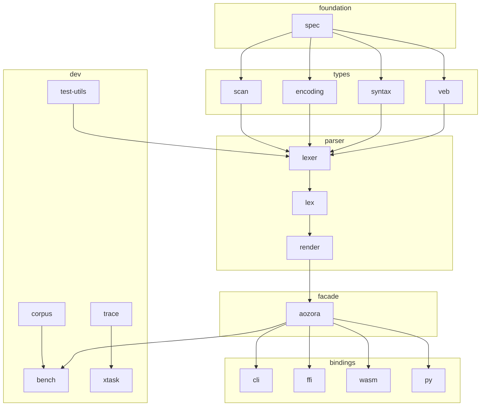

# Crate map

aozora is an 18-crate workspace. The split exists for three reasons:
narrow each crate's compile surface (faster `cargo check`), pin
dependency boundaries (cycles are forbidden by the layout), and let
each binding (CLI, WASM, FFI, Python) compose only the layers it
needs.

## At a glance

## Per-crate purpose

### Foundation

| Crate | Role |
|---|---|
| `aozora-spec` | Single source of truth for shared types: `Span`, `Diagnostic`, `TriggerKind`, `PairKind`, PUA sentinel codepoints. **No internal dependencies** — every other crate may depend on it. |

### Types & primitives

| Crate | Role |
|---|---|
| `aozora-veb` | `no_std` Eytzinger-layout sorted-set lookup. Cache-friendly binary search for sub-256-entry registries. |
| `aozora-syntax` | AST node types — `AozoraNode<'src>`, `Container<'src>`, `Bouten<'src>`, `Ruby<'src>`, …. Borrows from the bumpalo arena. |
| `aozora-encoding` | Shift_JIS decoding, JIS X 0213 patch, 外字 PHF resolver, accent decomposition. |
| `aozora-scan` | SIMD-friendly multi-pattern byte scanner. The only crate (besides `aozora-ffi`) that locally relaxes `unsafe_code` — for aligned-load SIMD intrinsics. |

### Parser

| Crate | Role |
|---|---|
| `aozora-lexer` | Seven-phase classifier pipeline (sanitize → scan → tokenize → classify → pair → resolve → diagnostics). Emits the diagnostic catalogue. |
| `aozora-lex` | Streaming orchestrator — fused `lex_into_arena` over the lexer's per-phase calls. The front door for the public crate. |
| `aozora-render` | HTML and canonical-serialisation walkers. Single O(n) tree pass each; no allocation outside the output buffer. |

### Facade

| Crate | Role |
|---|---|
| `aozora` | Public facade. `Document::parse() -> AozoraTree<'_>`, `tree.to_html()`, `tree.serialize()`, `tree.diagnostics()`. The single import for library consumers. |

### Bindings

| Crate | Role |
|---|---|
| `aozora-cli` | The `aozora` binary (`check` / `fmt` / `render`). |
| `aozora-ffi` | C ABI driver. Opaque handles, JSON-encoded structured data. Locally relaxes `unsafe_code`; every block carries a `// SAFETY:` comment. |
| `aozora-wasm` | `wasm32-unknown-unknown` target with `wasm-bindgen` exports. |
| `aozora-py` | PyO3 binding shipped via `maturin`. |

### Development-only

| Crate | Role |
|---|---|
| `aozora-bench` | Criterion + corpus-driven probes. Source of the PGO training data. |
| `aozora-corpus` | Corpus source abstraction (zstd-archived, blake3-pinned). Dev-only. |
| `aozora-proptest` | Shared proptest strategies. Dev-only. |
| `aozora-trace` | DWARF symbolicator + samply gecko-trace loader. Dev-only. |
| `aozora-xtask` | Host-side dev tooling (samply wrapper, trace analysis, corpus pack/unpack). Not on the `just build` path. |

## Why 18 crates?

Three concrete wins from the split.

### 1. Compile latency

A single-crate workspace with the same code would force a full
re-compile on any internal change. With 18 crates, a change in the
renderer doesn't touch the lexer, scanner, or any of the bindings —
incremental compile times stay sub-second on iteration.

### 2. No-std reach

`aozora-veb` and `aozora-spec` are `no_std`-clean. That matters for
the wasm32 build (where `std` is a real cost) and would matter for
embedded targets if anyone ever needed one. Keeping them in dedicated
crates *enforces* the `no_std` discipline at the crate-graph level —
adding a `std` import would require depending on a `std`-using crate,
which is a visible Cargo.toml change.

### 3. Binding modularity

The C ABI driver (`aozora-ffi`) needs `aozora` + `serde_json` and
nothing else. It does not pull in the bench harness, the trace
loader, or the corpus crate. The wasm driver is similarly minimal.
Each binding's dependency closure is exactly what it needs — which
is what keeps the wasm bundle inside its 500 KiB budget.

## What we deliberately *don't* split

A few things stay co-located despite plausible split points:

- **HTML render and canonical serialise** in `aozora-render`. Both
  are tree walkers; sharing the `walk()` helper between them keeps
  the implementation small.
- **Phase 0 sanitize sub-passes** in `aozora-lexer`. Each sub-pass
  is < 100 LOC and operates on the same `&str` slice; pulling them
  out would create a 5-crate ecosystem for a transformation that's
  conceptually one phase.
- **Trigger-byte enum and pair-kind enum** in `aozora-spec`. They're
  used by both `aozora-scan` (which produces them) and
  `aozora-lexer` (which consumes them); putting them in `spec`
  avoids a back-reference.

Splits aren't free — every additional crate adds a `Cargo.toml`, a
README, doc-link reachability, and a test surface. Splits land when
the *cohesion* benefit (one of the three above) is real.

## See also

- [Pipeline overview](pipeline.md)
- [Borrowed-arena AST](arena.md)
- [Reference → API](../ref/api.md) — generated rustdoc for the
  public surface.
