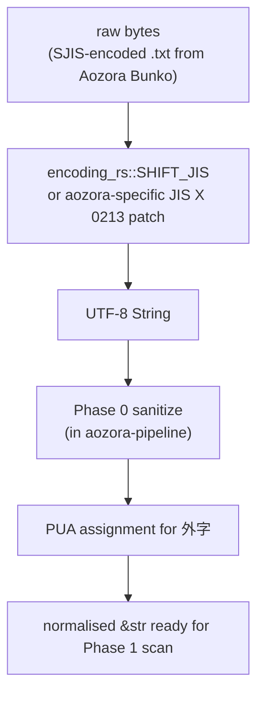

# Shift_JIS + 外字 resolver

`aozora-encoding` covers the full source-decoding stack:

1. Shift_JIS / Shift_JIS-2004 / cp932 byte stream → UTF-8 string.
2. JIS X 0213 plane-2 ideographs → Unicode (where possible).
3. 外字 references (`※［＃…］`) → resolved Unicode codepoint, JIS
   triple, or descriptive-text fallback.
4. Accent decomposition (114 ASCII digraph / ligature → Unicode).

All four are pure functions; the crate has no global state and
nothing that varies per-call.

## Decode chain



The Shift_JIS decode itself uses [`encoding_rs`](https://docs.rs/encoding_rs)
— the same crate Firefox uses for HTML decoding. Battle-tested,
SIMD-accelerated, and handles every Shift_JIS variant Aozora Bunko
sources have used since the 1990s. We add a thin patch layer for
JIS X 0213 plane-2 codepoints that `encoding_rs`'s strict cp932
mapping doesn't cover (Aozora's spec extends Shift_JIS into JIS
X 0213 territory; encoding_rs keeps the strict cp932 surface).

## 外字 (gaiji) PHF table

The reference table contains ~14 000 entries:

```rust
static GAIJI_TABLE: phf::Map<&'static str, GaijiEntry> = phf_map! {
    "1-94-37" => GaijiEntry::JisX0213 { plane: 1, row: 94, cell: 37, codepoint: '⿰魚師' },
    "U+5F85"  => GaijiEntry::Direct   { codepoint: '待' },
    "魚＋師のつくり" => GaijiEntry::Description { fallback: "[魚+師]" },
    …
};
```

**Why PHF (perfect hash function):**

- The table is large enough (~14 000 entries) that linear scan or
  Eytzinger search would dominate the lookup cost.
- It's static and known at compile time — the perfect hash is
  computable once.
- `phf` produces zero-allocation, zero-comparison-on-collision
  lookups. The hash is one `wyhash` round; the probe is one slice
  index; the comparison is one strcmp. ~25 ns per lookup on the
  bench harness.

**Why not `OnceLock<HashMap>`:**

- First-call cost: building a `HashMap<&str, GaijiEntry>` from 14 000
  entries on first use takes ~5 ms. That's longer than parsing a
  small document end-to-end.
- Memory: the runtime `HashMap` takes 2–3× the size of the static
  PHF (load-factor padding + `RawTable` metadata).
- Concurrency: `OnceLock` adds an atomic load on every access, even
  after initialisation. PHF is `static` — no synchronisation.

**Why not load from a JSON / TOML asset:**

- Adds startup cost on every `Document::new` (file I/O is microseconds
  away from the parser's whole runtime budget for small inputs).
- Forces every binding (CLI / WASM / FFI / Python wheel) to ship the
  asset as a separate file, complicating distribution.
- Defeats dead-code elimination: the linker can't strip entries the
  consumer's input never references.

The build-time cost of compiling the PHF (~40 s the first time, 0 s
incremental) is paid once per workspace build, not per-invocation.

## Resolution order

```rust
pub fn resolve(reference: &str) -> Resolved {
    // 1. Direct codepoint (U+XXXX) wins outright.
    if let Some(c) = parse_unicode_form(reference) { return Resolved::Direct(c); }

    // 2. JIS X 0213 plane-row-cell triple.
    if let Some(triple) = parse_jis_triple(reference) {
        if let Some(c) = JIS_TABLE.get(&triple) { return Resolved::Lookup(c); }
    }

    // 3. Descriptive name lookup (curated subset).
    if let Some(fallback) = DESCRIPTION_TABLE.get(reference) {
        return Resolved::Fallback(fallback);
    }

    Resolved::Unknown
}
```

Three layers, in order. `Direct` wins because the source author
explicitly *wrote* a Unicode codepoint — overriding it would be
wrong even if our JIS table disagreed. `Lookup` is the common case.
`Fallback` is the curated subset of characters that have no Unicode
codepoint at all (~120 entries from the 14 000); we ship a
descriptive-text rendering rather than dropping the character.
`Unknown` fires diagnostic [`W0006`](../notation/diagnostics.md#W0006).

## Accent decomposition

Older Aozora works encode accented Latin letters using a separate
notation that is *not* a `※［＃…］` reference:

```text
M[i!]cher  →  Micher
M[a!]ria   →  Maria
[ae]on     →  Aeon
```

The full mapping (114 entries — every digraph and ligature in the
spec) is at `accent_separation.html` in the spec snapshot. aozora
applies this decomposition during Phase 0 sanitize, *before* the
trigger scan, so by Phase 1 the source is pure Unicode with no
ASCII-encoded accents.

The lookup is also Eytzinger-laid (see
[Eytzinger sorted-set lookup](veb.md)) since 114 entries is well
inside its favourable regime.

## Why a single crate for all of this?

`encoding`, `gaiji`, and `accent` are three distinct concerns, but:

- They all need to be applied *once*, in order, at the boundary
  between the source bytes and the parser proper.
- Splitting them would force three separate crate surfaces and
  three separate trigger points in the lexer.
- Their data tables are all built from upstream Aozora Bunko spec
  pages, so a single update workflow (refresh `docs/specs/aozora/`,
  re-extract tables) hits all three at once.

Co-locating them in one crate keeps the boundary tight and the
update surface predictable.

## See also

- [Notation → Gaiji](../notation/gaiji.md) — author-facing notation
  reference.
- [Four-phase lexer → Phase 0](lexer.md#phase-0-sanitize) — where
  the resolver is invoked.
