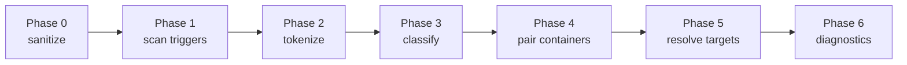

# Seven-phase lexer

`aozora-lexer` runs as seven distinct phases, each a pure function
on the previous phase's output. The split exists because each phase
has a different cost profile — separating them keeps the dominant
hot path (Phase 2 tokenize) tight, and lets the bench harness measure
each phase independently via the `phase_breakdown` probe.

## Phase ordering



Each arrow carries a small data structure (offsets, slices, AST
nodes); no phase reads back into a previous phase's output.

| Phase | Input | Output | What it does |
|---|---|---|---|
| 0 — Sanitize | raw `&str` | normalised `&str` | BOM strip, CRLF → LF, accent decomp, PUA assignment for gaiji refs |
| 1 — Scan | normalised `&str` | trigger offsets `&[Trigger]` | SIMD multi-pattern scan for `｜《》※［］` |
| 2 — Tokenize | normalised `&str` + offsets | `&[Token]` | Slice the source at trigger boundaries; classify each slice as `Plain` / `Open` / `Close` / `RefMark` |
| 3 — Classify | `&[Token]` | `&[ClassifiedToken]` | Recogniser registry decides what each `［＃…］` body actually is |
| 4 — Pair | `&[ClassifiedToken]` | `&[Container]` | Bracket matching: openers ↔ closers, build container tree |
| 5 — Resolve | `&[Container]` + source | `AozoraTree<'_>` | Look-back resolution for bouten / tcy targets, tie inline annotations to AST nodes |
| 6 — Diagnostics | `AozoraTree<'_>` + accumulator | `Diagnostics` | Collect diagnostics from earlier phases, sort by span, pin codes |

## Phase 0: sanitize

The most varied phase by what it touches. Sub-passes:

- **bom_strip** — UTF-8 / UTF-16 BOM detection and removal.
- **crlf** — CRLF → LF in one `memchr2` pass.
- **rule_isolate** — separate inline `※［＃…］` from following text
  so the tokenizer has unambiguous boundaries.
- **accent** — 114 ASCII digraph / ligature decomposition (see
  [Notation → Gaiji](../notation/gaiji.md#accent-decomposition)).
- **pua_scan** — assign each `※［＃…］` reference a private-use
  codepoint inline so subsequent phases treat it as a single
  character.

Each sub-pass is independent; `phase0_breakdown` probe measures them
separately. In the corpus sweep, `pua_scan` dominates Phase 0 (60%
of phase wall time on average) because it has to `※［＃…］` scan
the whole document — the SIMD scanner from Phase 1 isn't yet active.

## Phase 1: scan triggers

The hot path. SIMD multi-pattern scan for the seven trigger bytes:

```text
｜  《  》  ※  ［  ］  　 (full-width space)
```

The chosen scanner backend (Teddy, Hoehrmann DFA, memchr-based)
produces a `&[Trigger]` of byte offsets. See
[SIMD scanner backends](scanner.md) for the selection logic.

Throughput on a typical mid-size work (`crime_and_punishment.txt`,
~600 KiB UTF-8): ~12 GB/s on Teddy, ~3.5 GB/s on the DFA fallback.
Both are well above the rest of the pipeline's throughput — Phase 1
is essentially free at the corpus level.

## Phase 2: tokenize

Slice the source at trigger boundaries and classify each slice:

```rust
pub enum Token<'src> {
    Plain(&'src str),
    Open(OpenKind, Span),
    Close(CloseKind, Span),
    RefMark(Span),                // ※ in isolation
}
```

Single linear pass over the trigger array; no allocation outside the
output `Vec` (which is sized exactly from the trigger count).

## Phase 3: classify

The most code-heavy phase. The classifier registry has one
recogniser per `［＃…］` directive family:

- `RubyRecogniser`
- `BoutenRecogniser`
- `TcyRecogniser`
- `IndentRecogniser`
- `AlignRecogniser`
- `LineLengthRecogniser`
- `BreakRecogniser`
- `KaeritenRecogniser`
- … 17 in total

The recognisers run in deterministic order; the *first* recogniser
that matches the directive body wins. Order matters because some
directive bodies are valid prefixes of others (e.g. `ここから2字下げ`
is valid prefix of `ここから2字下げ、地寄せ`). Compile-time tests
in `aozora-lexer` enforce ordering invariants.

The recognisers themselves are short (most are < 50 LOC) — the bulk
of classify cost is the `phf::Map` of directive prefixes the
recognisers share for opener detection.

## Phase 4: pair

Bracket matching. Walk the classified token stream, push openers
onto a stack, pop on closers, fail if mismatched. The output is a
tree of `Container<'_>` nodes whose children are flat `&[Token<'_>]`
slices.

Single linear pass; the stack is a `SmallVec<[ContainerKind; 8]>` so
it stays on the stack for typical 1–4 deep nesting.

## Phase 5: resolve

Bouten / tcy targets quote-by-look-back: the directive `［＃「平和」に傍点］`
applies to the most recent `平和` in the preceding text. Phase 5
walks the container tree and resolves these references.

Pre-Phase-5 the tree carries unresolved `BoutenRef { target: "平和" }`
nodes; post-Phase-5 they're `Bouten { target_span: Span }` pointing
at the actual matched run. The resolver uses an `aho-corasick` DFA
over the live target strings — single-pass over the source, no
recogniser-order dependencies.

## Phase 6: diagnostics

Collect, sort by span, pin codes. Diagnostics emitted in earlier
phases were buffered in a `DiagnosticAccumulator` threaded through
the call stack; Phase 6 sorts them and assigns the stable error
codes (`E0001`, `W0001`, …).

## Why seven phases, not one big function?

Three reasons.

1. **Bench-driven optimisation.** The `phase_breakdown` probe
   reports per-phase wall time per corpus document. Knowing that
   "this document spends 80% of parse time in Phase 3 classify"
   tells you exactly where to focus a perf PR. A monolithic `lex()`
   would force you to re-instrument every PR.
2. **Spec compliance.** Each phase corresponds to a discrete
   transformation that the spec describes. If a spec gap shows up
   in production, it almost always lands in one phase, and the test
   harness can pin a regression test that exercises *that phase
   only*.
3. **Composability.** `aozora-lexer` exposes both the fused
   `lex_into_arena` and the per-phase calls. The fused version is
   what `aozora-lex` ships to consumers; the per-phase calls are
   what the bench harness and integration tests use to isolate
   regressions.

The cost is conceptual (more API surface internal to the lexer); the
win is that every perf decision in the parser has a measurement
attached.

## See also

- [Pipeline overview](pipeline.md) — how the lexer fits into the
  parse layer.
- [SIMD scanner backends](scanner.md) — Phase 1 in detail.
- [Performance → Profiling with samply](../perf/samply.md) — how to
  measure the per-phase cost on your own workload.
