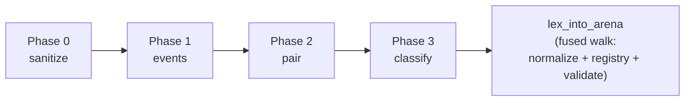

# Four-phase lexer

`aozora-pipeline` runs the lexer as four pure-functional phases,
each `fn(input) -> output` with no shared mutable state. The split
keeps the dominant hot path (Phase 1 events / Phase 3 classify)
tight, lets the bench harness measure each phase independently, and
maps every diagnostic to a single phase boundary.

The single public entry [`lex_into_arena`] drives all four phases
and lands the resulting borrowed AST inside an
`aozora_syntax::borrowed::Arena` provided by the caller. The legacy
"phase 4 normalize / phase 5 registry / phase 6 validate" steps
disappeared into a fused walk inside `lex_into_arena`; they no
longer have standalone phase functions.

## Phase ordering



Each arrow carries a small data structure (sanitised text, trigger
events, pair events, classified spans); no phase reads back into a
previous phase's output.

| Phase | Input | Output | Responsibility |
|---|---|---|---|
| 0 — Sanitize | raw `&str` | `SanitizeOutput { sanitized: &str, .. }` | BOM strip, CRLF → LF, accent decomposition, decorative-rule isolation, PUA collision pre-scan |
| 1 — Events | sanitised `&str` | `Iterator<Item = Token>` | SIMD trigger scan (`aozora-scan`) followed by linear tokenise into `Plain` / trigger events |
| 2 — Pair | `Iterator<Token>` | `Iterator<Item = PairEvent>` | Balanced-stack pairing for all opener/closer trigrams (`｜》《`, `［］`, `〔〕`, `「」`, `《《》》`) |
| 3 — Classify | `Iterator<PairEvent>` | `Iterator<Item = ClassifiedSpan>` | Full-spec Aozora classification into [`AozoraNode`] variants (ruby, bouten, gaiji, tcy, kaeriten, sashie, annotation, …) |

The orchestrator [`lex_into_arena`] consumes the Phase 3 stream,
substitutes PUA sentinels into the normalised text, builds the
side-table registry that maps sentinel positions back to
classified `AozoraNode` values, and accumulates diagnostics — all
in a single fused walk over the classified-span stream.

## Phase 0: sanitize

The most varied phase by what it touches. Sub-passes (in order):

- **bom_strip** — UTF-8 BOM detection and removal at the head.
- **normalize_line_endings** — CRLF → LF in one `memchr2` pass.
- **rewrite_accent_spans** — ASCII digraph / ligature decomposition
  for [accent gaiji](../notation/gaiji.md#accent-decomposition).
- **isolate_decorative_rules** — long horizontal-rule lines (`──────────`
  patterns) get separated from neighbouring text so Phase 1's
  trigger scan does not split them mid-glyph.
- **scan_for_sentinel_collisions** — pre-scan for stray PUA codepoints
  (`U+E001..U+E004`); any hit emits `Diagnostic::SourceContainsPua`
  and the colliding bytes flow through verbatim (the registry has
  no entry for them, so they degrade to plain text).

Each sub-pass is independent and runs over the same buffer. The
output `SanitizeOutput` carries the rewritten text alongside any
diagnostics emitted along the way.

## Phase 1: events

The hot path. SIMD multi-pattern scan from
[`aozora-scan`](scanner.md) finds every trigger byte position; a
single linear walk converts those positions into `Token` events:

```rust
pub enum Token<'src> {
    Plain(&'src str),
    Trigger(TriggerKind, Span),
}
```

The trigger scan and the tokenise loop fuse so the output stream
allocates no per-event vector — downstream phases consume the
iterator directly. See [SIMD scanner backends](scanner.md) for the
runtime backend selection.

Throughput on a typical mid-size work (`crime_and_punishment.txt`,
~600 KiB UTF-8): on the order of GB/s for the SIMD backends, which
is well above the rest of the pipeline's throughput; Phase 1 is
essentially free at the corpus level. Concrete numbers are pinned
by `cargo bench -p aozora-bench --bench crime_and_punishment` and
the synthetic corpus bench.

## Phase 2: pair

Balanced-stack bracket matching. Walk the trigger event stream,
push openers onto a `SmallVec<[(PairKind, Span); 8]>` (inline
capacity 8 covers 99th-percentile bracket nesting in real corpus),
pop on closers, and emit a `PairEvent::Solo` / `Matched` /
`Unmatched` / `Unclosed` for every trigger.

Phase 2 is also the first place [recovery semantics](error-recovery.md)
fire: stray closers and unmatched openers each emit a structured
diagnostic but never abort, so downstream consumers see a complete
event stream regardless of input wellformedness.

## Phase 3: classify

The most code-heavy phase. The classifier maps `PairEvent`s to
[`AozoraNode`] variants via a slug-canonicalised dispatch table
([`SLUGS`] / `canonicalise_slug`). Recognisers are organised per
construct family:

- Ruby (`｜青梅《おうめ》`, with implicit-base auto-glob)
- Bouten / forward-bouten (`［＃「平和」に傍点］`, with look-back target resolution)
- Tate-chu-yoko (`［＃「12」は縦中横］`)
- Gaiji (`※［＃説明、ページ-行］`)
- Kaeriten (Chinese-text reading marks)
- Sashie (illustrations)
- Indent / alignment / line-length annotations
- Section / page breaks

The recogniser dispatch is deterministic and slug-canonicalised so
prefix collisions (`ここから2字下げ` vs `ここから2字下げ、地寄せ`)
resolve via the [`SLUGS`] entry's family + arity, not by recogniser
ordering. Look-back targets (bouten / tcy) resolve against the
sanitised text in the same walk.

## Fused finishing walk

After Phase 3, [`lex_into_arena`] runs a single output-build walk
that does what was once three separate phases:

- **Normalise** — substitute each Aozora span with its PUA sentinel
  (`U+E001`/`E002`/`E003`/`E004` for inline / block-leaf / block-open
  / block-close) so the downstream CommonMark parser sees a flat
  text with single-codepoint placeholders.
- **Register** — build the [`Registry`] (an `EytzingerMap<u32, NodeRef<'src>>`,
  see [van Emde Boas / Eytzinger layout](veb.md)) keyed by sentinel
  byte position so the post-process walk can recover the borrowed-AST
  node from a normalised position in `O(log n)`.
- **Validate + diagnostics** — collect every Phase-0 / Phase-2 /
  Phase-3 diagnostic, sort by span, and pin stable codes
  (`aozora::lex::source_contains_pua`, `aozora::lex::unclosed_bracket`,
  …; see [diagnostics](../notation/diagnostics.md)).

Performing all three in one walk avoids three extra passes over
the (potentially MB-class) source and keeps the `Registry`'s
`EytzingerMap` build amortised.

## Why four phases, not one big function?

Three reasons.

1. **Bench-driven optimisation.** Per-phase boundaries let
   `cargo bench -p aozora-bench` measure each phase's wall time
   independently. Knowing that "this document spends 80 % of parse
   time in Phase 3 classify" tells you where the next perf PR
   belongs. A monolithic `lex()` would force re-instrumentation in
   every PR.
2. **Spec compliance.** Each phase corresponds to a discrete
   transformation the spec describes. Spec gaps in production
   almost always land in one phase, and the
   [conformance suite](../conformance.md) can pin regression
   fixtures targeting that phase only.
3. **Composability.** `aozora-pipeline` exposes both the fused
   [`lex_into_arena`] entry and the per-phase functions
   (`sanitize`, `tokenize` / `tokenize_in`, `pair` / `pair_in`,
   `classify`). Production code uses the fused entry; benchmarks
   and the [type-state Pipeline state machine](pipeline.md) use
   per-phase calls to isolate regressions.

The cost is conceptual (more API surface internal to the crate);
the win is that every perf decision in the parser has a
measurement attached.

## See also

- [Pipeline overview](pipeline.md) — how the lexer fits into the
  full parse layer.
- [SIMD scanner backends](scanner.md) — Phase 1's trigger scan.
- [Error recovery](error-recovery.md) — what each phase does when a
  diagnostic fires.
- [Performance → Profiling with samply](../perf/samply.md) — how to
  measure the per-phase cost on your own workload.

[`lex_into_arena`]: https://docs.rs/aozora-pipeline/latest/aozora_pipeline/fn.lex_into_arena.html
[`AozoraNode`]: https://docs.rs/aozora-syntax/latest/aozora_syntax/borrowed/enum.AozoraNode.html
[`SLUGS`]: https://docs.rs/aozora-spec/latest/aozora_spec/static.SLUGS.html
[`Registry`]: https://docs.rs/aozora-pipeline/latest/aozora_pipeline/struct.Registry.html
