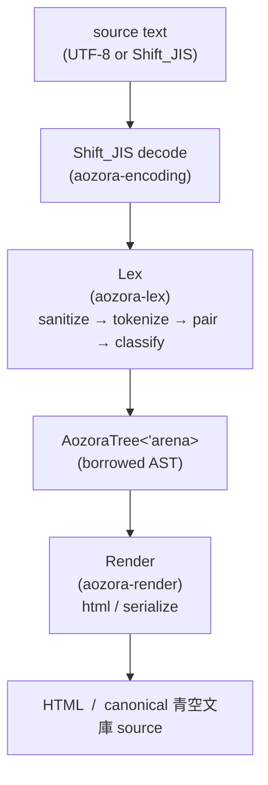
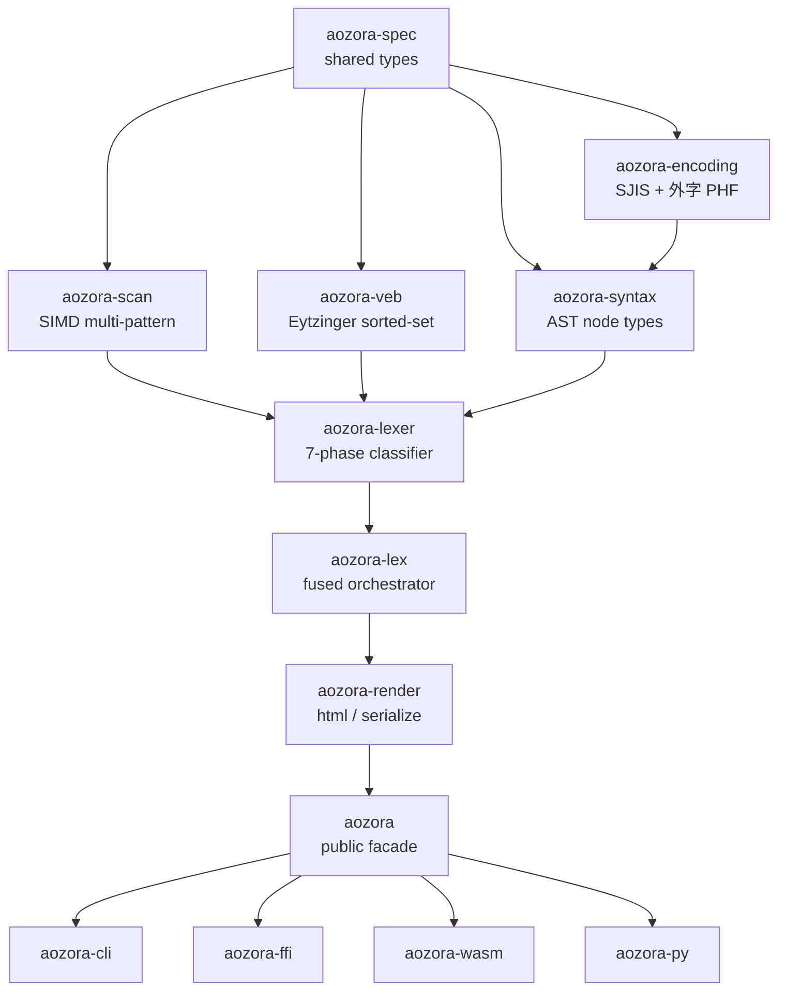

# Pipeline overview

aozora is a *pure-functional* parser: given the same input, the same
arena, and the same compile-time configuration, the output is
bit-for-bit identical. There are no thread-locals, no `OnceCell`
caches in the parse path, no environmental side effects. The only
state the parser owns is the arena and a string interner, both reset
per `Document`.

## Three layers

Each arrow is a pure function. The arena is threaded through `lex`;
nothing else holds state.

## Crate dependency graph

`aozora-spec` is the foundation — every other crate depends on it.
The dependency graph forms a strict DAG; circular deps are forbidden
by clippy's [`cyclic_module`] lint and by the `cargo metadata` check
in `just lint`.

## What each layer does

### Sanitize → Tokenize → Pair → Classify

The lexer pipeline is split into four sub-phases because each stage
has a different cost / cache profile:

| Sub-phase | Input | Output | Why separate |
|---|---|---|---|
| Sanitize | raw `&str` | normalised `&str` | BOM / CRLF / accent-decomposition / PUA assignment all happen here, *once*, before any expensive lookahead. Keeps later phases linear-time. |
| Tokenize | normalised `&str` | trigger offsets | SIMD scanner fires here; finds every `｜` `《` `》` `※` `［` `］` byte. |
| Pair | trigger offsets | balanced `(open, close)` pairs | Bracket matching only; no semantic interpretation. |
| Classify | pairs + slices | `AozoraNode<'_>` stream | Decides "is this `［＃…］` an indent opener, a bouten directive, a tcy directive, …". |

Splitting them lets the parser ship two surface APIs without code
duplication:

- `lex_into_arena()` — fused, allocates one tree.
- Per-phase calls — used by the bench harness's
  `phase_breakdown` probe (and the `aozora-lexer` integration tests
  for spec-conformance).

### Sanitize details

Phase 0 sanitize covers:

- **BOM strip** — UTF-8 and UTF-16 BOMs (rare in source, but real).
- **CRLF normalisation** — CRLF → LF.
- **Rule isolation** — separates inline `※［＃…］` from following
  text so the tokenizer has unambiguous boundaries.
- **Accent decomposition** — 114 ASCII digraphs / ligatures →
  Unicode (see [Gaiji](../notation/gaiji.md)).
- **PUA assignment** — gaiji references get private-use codepoints
  inline so the tokenizer can treat them as single-character tokens
  without re-parsing the `※［＃…］` body.

### Tokenize: SIMD scan

Trigger byte detection runs the SIMD multi-pattern scanner. Three
backends:

- **Teddy** (Hyperscan-style packed-pattern via `aho-corasick`) on
  x86_64 with AVX2.
- **Hoehrmann-style multi-pattern DFA** (`regex-automata` engine) as
  the portable fallback.
- **Memchr-based** for `wasm32` until `wasm-simd` lands in the
  workspace.

See [Architecture → SIMD scanner backends](scanner.md) for the
selection logic and what each backend looks like in samply.

### Pair → Classify

Bracket matching is a single linear-time stack walk over the trigger
offsets. Classify then does the *actual* recognition: each opener
type has a recogniser registered under
`aozora-lexer::recognisers::*`. The recognisers run in deterministic
order (see [Architecture → Seven-phase lexer](lexer.md)).

### Render

Two render walkers:

- `html::render_to_string` — a single O(n) tree walk emitting
  semantic HTML5 with `aozora-*` class hooks.
- `serialize::serialize` — re-emits canonical 青空文庫 source.

Both are pure functions; both allocate exactly the output buffer and
nothing else.

## What the pipeline does *not* do

No tree mutation between layers. No optimisation passes. No
"resolver" stage that mutates the AST. The lexer produces the
final tree; the renderer consumes it; that's it. This is the same
shape as a functional reactive pipeline, and it's what lets the
borrowed-arena AST (next chapter) work without `RefCell` or
`UnsafeCell`.

## See also

- [Borrowed-arena AST](arena.md) — what `AozoraTree<'arena>`
  actually points at.
- [Seven-phase lexer](lexer.md) — the inside of the Lex box.
- [Crate map](crates.md) — every crate, its purpose, what depends
  on what.
