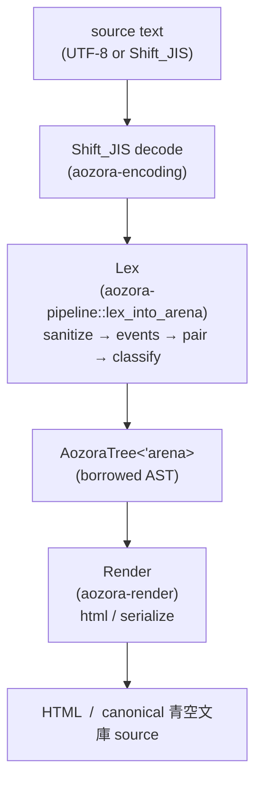
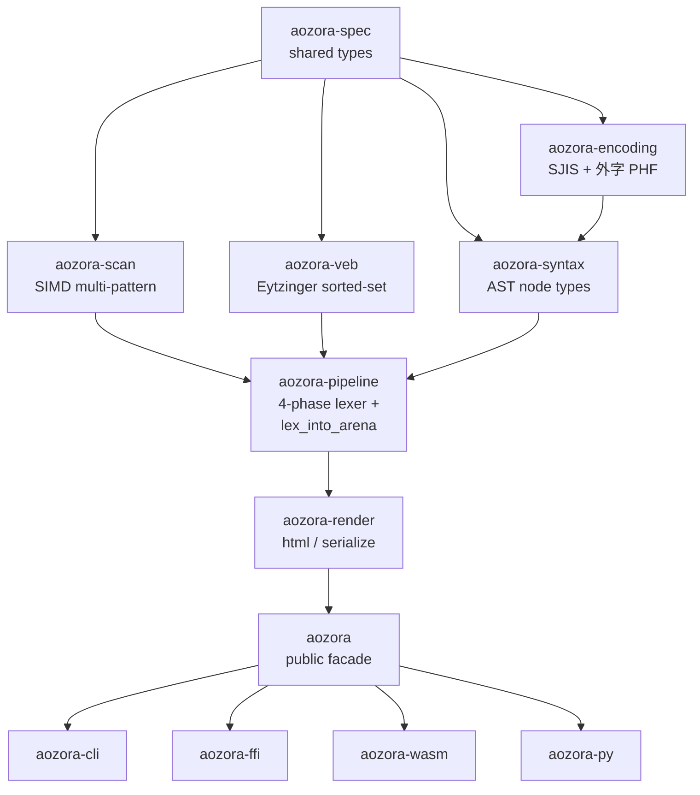

# Pipeline overview

aozora is a *pure-functional* parser: given the same input, the same
arena, and the same compile-time configuration, the output is
bit-for-bit identical. There are no thread-locals, no `OnceCell`
caches in the parse path, no environmental side effects. The only
state the parser owns is the arena and a string interner, both reset
per `Document`.

## Three layers

Each arrow is a pure function. The arena is threaded through `lex`;
nothing else holds state.

## Crate dependency graph

`aozora-spec` is the foundation — every other crate depends on it.
The dependency graph forms a strict DAG; circular deps are forbidden
by `cargo deny`'s `bans` config and by the `cargo metadata` check
in `just lint`.

## What each layer does

### Sanitize → Events → Pair → Classify

The lexer pipeline is split into four phases because each stage has
a different cost / cache profile:

| Phase | Input | Output | Why separate |
|---|---|---|---|
| Sanitize | raw `&str` | normalised `&str` + Phase-0 diagnostics | BOM / CRLF / accent decomposition / decorative-rule isolation / PUA collision pre-scan all happen here, *once*, before any expensive lookahead. Keeps later phases linear-time. |
| Events | sanitised `&str` | `Iterator<Token>` | SIMD trigger scan (`aozora-scan`) fires here; the linear tokenise that follows fuses with the scan so no per-event vector is allocated. |
| Pair | `Iterator<Token>` | `Iterator<PairEvent>` | Balanced-stack bracket matching across all opener / closer pairs (`｜》《`, `［］`, `〔〕`, `「」`, `《《》》`). Recovery diagnostics for unclosed / unmatched fire here. |
| Classify | `Iterator<PairEvent>` | `Iterator<ClassifiedSpan>` (→ `AozoraNode<'arena>`) | Decides "is this `［＃…］` an indent opener, a bouten directive, a tcy directive, …" via the slug-canonicalised dispatch table. |

Splitting them lets the parser ship two surface APIs without code
duplication:

- [`lex_into_arena`] — fused, allocates one borrowed-AST tree.
- Per-phase calls (`sanitize`, `tokenize`, `pair`, `classify`) —
  used by the bench harness's per-phase probes and the integration
  tests in `crates/aozora-pipeline/tests/`.

### Sanitize details

Phase 0 sanitize covers:

- **BOM strip** — UTF-8 BOM detection at the head.
- **CRLF normalisation** — CRLF → LF in one `memchr2` pass.
- **Decorative rule isolation** — separates long horizontal-rule
  patterns from neighbouring text so Phase 1's trigger scan does not
  split them mid-glyph.
- **Accent decomposition** — ASCII digraphs / ligatures → Unicode
  (see [Gaiji](../notation/gaiji.md)).
- **PUA collision pre-scan** — emits
  `Diagnostic::SourceContainsPua` for stray `U+E001..U+E004` codepoints
  in the source so they can never be confused with the lexer's own
  sentinel insertions later.

### Events: SIMD scan

Trigger byte detection runs the SIMD multi-pattern scanner from
[`aozora-scan`](scanner.md). Multiple backends share a common
trait; selection happens once via runtime CPU detection and is
cached for the process lifetime. See
[Architecture → SIMD scanner backends](scanner.md) for the dispatch
order and what each backend looks like in `samply`.

### Pair → Classify

Bracket matching is a single linear-time stack walk over the trigger
event stream. Classify then does the *actual* recognition: each
opener type maps via the [`SLUGS`] dispatch table to a recogniser,
and the recogniser produces the borrowed `AozoraNode<'arena>` that
[`lex_into_arena`] then registers and substitutes a PUA sentinel for.
The slug canonicalisation makes prefix collisions
(`ここから2字下げ` vs `ここから2字下げ、地寄せ`) deterministic without
relying on declaration order. Look-back targets (bouten / tcy)
resolve in the same walk against the sanitised text.

### Render

Two render walkers:

- `html::render_to_string` — a single O(n) tree walk emitting
  semantic HTML5 with `aozora-*` class hooks.
- `serialize::serialize` — re-emits canonical 青空文庫 source.

Both are pure functions; both allocate exactly the output buffer and
nothing else.

## What the pipeline does *not* do

No tree mutation between layers. No optimisation passes. No
"resolver" stage that mutates the AST. The lexer produces the
final tree; the renderer consumes it; that's it. This is the same
shape as a functional reactive pipeline, and it's what lets the
borrowed-arena AST (next chapter) work without `RefCell` or
`UnsafeCell`.

## See also

- [Borrowed-arena AST](arena.md) — what `AozoraTree<'arena>`
  actually points at.
- [Four-phase lexer](lexer.md) — the inside of the Lex box.
- [Crate map](crates.md) — every crate, its purpose, what depends
  on what.

[`lex_into_arena`]: https://docs.rs/aozora-pipeline/latest/aozora_pipeline/fn.lex_into_arena.html
[`SLUGS`]: https://docs.rs/aozora-spec/latest/aozora_spec/static.SLUGS.html
