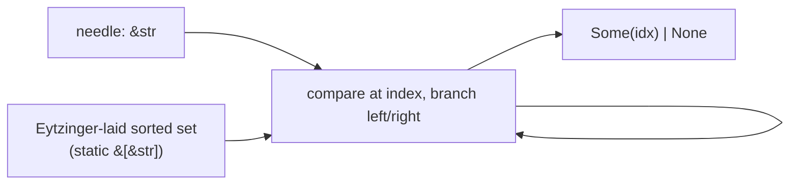

# Eytzinger sorted-set lookup

`aozora-veb` is a `no_std` crate that provides one data structure: a
sorted-set lookup over a static byte slice, laid out in
**Eytzinger order** so that the binary search is cache-friendly. It
backs the placeholder registry the lexer uses to recognise the
fixed-set strings inside `［＃…］` directives ("ここから", "ここで",
"傍点", "傍線", "字下げ", …).



## What is Eytzinger order?

A standard sorted array stores elements in their natural order:
`[a, b, c, d, e, f, g]`. Binary search visits indexes
`3, 1 or 5, 0/2/4/6` — accesses that are *spatially distant* in
memory. On modern CPUs that's a cache miss per level past L1.

Eytzinger order stores the same elements in *implicit-binary-tree*
order: the root at index 1 (index 0 is reserved as a sentinel),
left child at `2i`, right child at `2i+1`. The walk visits indexes
`1, 2 or 3, 4/5/6/7` — accesses that are *consecutive* in memory.

For 256+ entries the cache-line packing is a measured 2–3× speedup
over `std::slice::binary_search` on the same data. Below 64 entries
the difference is in the noise (everything fits in one cache line).
The placeholder registry has ~120 entries — well into Eytzinger's
favourable regime.

## Why this and not `phf::Set`?

`phf::Set` is a perfect-hash table: O(1) lookup, but with a real
constant — one hash computation, one table probe, one strcmp. For
short strings (the placeholder registry's median is 4 chars) the
hash dominates, and the table probe is a pointer chase to a separate
allocation.

Eytzinger search is *log N* — but for N=120 that's 7 comparisons,
all in one contiguous slice, no hashing, no separate allocation.
Measured: Eytzinger is ~1.5× faster than `phf::Set` on this
workload.

For larger sets (the gaiji table at ~14 000 entries),
`phf::Set` wins — log₂(14000) is 14 comparisons and the cache
locality stops mattering. The choice is entry-count-dependent.
The aozora codebase uses Eytzinger for sub-256-entry tables and
`phf::Set` for larger ones; the cutoff was determined empirically.

## Why not a hash table?

A `HashMap<&str, ()>` allocates and rehashes; `phf` and Eytzinger
don't. In the lexer's Phase 3 classify, the placeholder registry
is hit once per `［＃…］` directive — measured as ~5 lookups per
KB of source. A `HashMap`'s startup cost (build the table from a
`const` array on first use, even with `OnceLock`) would dominate
the parser's per-`Document::parse` cost on tiny inputs.

## API

```rust
pub struct EytzingerSet<'a> {
    entries: &'a [&'a str],   // already in Eytzinger order
}

impl<'a> EytzingerSet<'a> {
    pub const fn new(entries: &'a [&'a str]) -> Self { Self { entries } }

    pub fn contains(&self, needle: &str) -> bool { … }
    pub fn position(&self, needle: &str) -> Option<usize> { … }
}
```

`new` is `const fn` so registries are computed at compile time and
end up in `.rodata`. Lookup is a single function with no allocation.

## Building the order

The crate ships a build-time helper that takes a sorted slice and
produces the Eytzinger permutation:

```rust
const PLACEHOLDERS: &[&str] = aozora_veb::eytzinger_layout!(
    "ここから", "ここで", "傍点", "傍線", "字下げ", …
);
```

The macro is `const`-evaluated; the resulting slice is what
`EytzingerSet::new` takes.

## Why a separate crate?

The lookup is `no_std` and has no aozora-specific dependencies. By
extracting it, three things become true:

1. The lexer can depend on `aozora-veb` without pulling in any
   workspace state, which keeps `aozora-veb`'s test surface small.
2. `aozora-veb` can be reused by `aozora-encoding` (for the
   accent decomposition table) and by `aozora-bench` (for category
   slug lookups in the trace rollup) without forming a circular
   dependency.
3. Future consumers can depend on just `aozora-veb` for the data
   structure, without taking the whole parser.

## See also

- [Crate map](crates.md) — `aozora-veb` is the foundation crate
  with no internal deps.
- [Performance → Benchmarks](../perf/bench.md) — the Eytzinger vs
  `phf` cutoff measurement.
