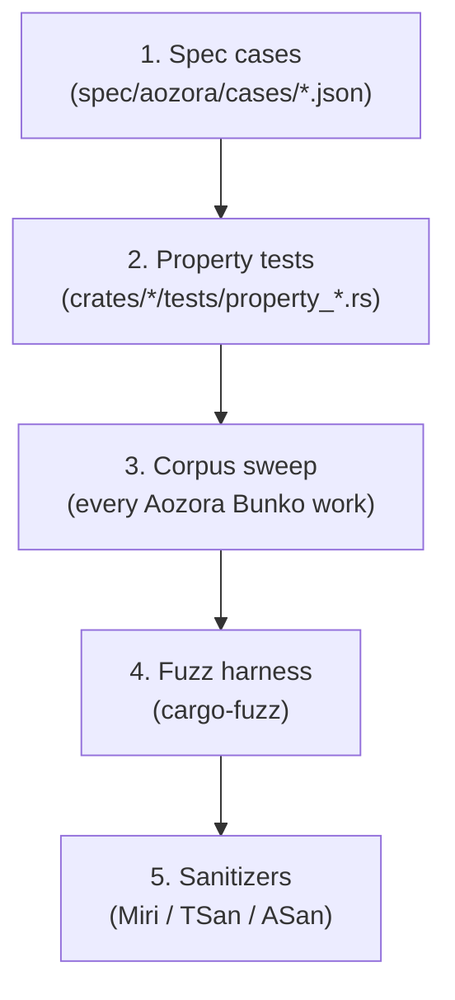

# Testing strategy

aozora targets **C1 100% branch coverage** as a goal — but coverage
is the floor, not the ceiling. Every invariant is asserted from
multiple angles so a single missed test path doesn't silently hide
a regression.

## The five test layers



Each layer catches a different *kind* of bug:

| Layer | Catches |
|---|---|
| Spec cases | Per-feature contract regressions (the `(input, html, canonical)` triple). |
| Property tests | Invariant violations in the *space* of inputs (round-trip, escape-safety, span well-formedness). |
| Corpus sweep | Real-world distribution effects the property generator missed. |
| Fuzz | Latent panics on adversarial inputs the corpus doesn't contain. |
| Sanitizers | UB / data race / heap-corruption issues the language can't catch. |

When you add a new invariant, **land all five touchpoints in the
same PR**, or split them into a chain of PRs that explicitly
references the invariant.

## Layer 1: spec cases

```text
spec/aozora/cases/
├── ruby-nested-gaiji.json
├── emphasis-bouten.json
├── emphasis-double-ruby.json
├── kunten-kaeriten.json
├── page-break.json
└── …
```

Each case pins a `(input, html, serialise)` triple:

```json
{
  "input":     "｜青梅《おうめ》",
  "html":      "<ruby>青梅<rt>おうめ</rt></ruby>",
  "serialise": "｜青梅《おうめ》"
}
```

The unit test runner (`cargo nextest run -p aozora-render`) loads
every case, parses, renders, serialises, and compares against the
pinned strings. The property harness *also* uses these cases as
seed inputs for shrinking.

The flagship in-tree fixture lives at
`spec/aozora/fixtures/56656/` — the Japanese translation of *Crime
and Punishment* (Aozora Bunko card 56656). It exercises 1000+ ruby
annotations, forward-reference bouten, JIS X 0213 gaiji, and
accent decomposition edge cases.

## Layer 2: property tests

[`proptest`](https://docs.rs/proptest) generators in
`crates/aozora-test-utils` drive parse / render / round-trip
invariants. Default 128 cases per `proptest!` block (CI budget);
`just prop-deep` runs 4096 per block (release-cut budget).

```sh
just prop                       # 128 cases
just prop-deep                  # 4096 cases
AOZORA_PROPTEST_CASES=10000 cargo nextest run --workspace --test 'property_*'
```

**Why proptest over quickcheck:**

- Proptest's shrinker is structural (reduces by the *generator's*
  ops), so a counterexample collapses to a minimal reproduction
  that still fails. Quickcheck shrinks per-type, which produces
  noisier outputs.
- Proptest persists failure seeds to `proptest-regressions/` —
  every reproduced failure becomes a permanent regression test.
  Quickcheck has nothing like this.

**Why a separate generator crate (`aozora-test-utils`):**

The generators are non-trivial (they have to produce *valid*
青空文庫 source — random byte streams would just stress the parser's
error path, which the fuzz harness already covers). Centralising
them means every property test in every crate gets the same
generator quality, and the generator itself can be unit-tested.

## Layer 3: corpus sweep

```sh
export AOZORA_CORPUS_ROOT=$HOME/aozora-corpus
just corpus-sweep
```

Walks every `.txt` under `$AOZORA_CORPUS_ROOT`, parses, verifies
the round-trip property holds, no panics. ~17 000 works in active
rotation; ~90 s sweep on a modern x86_64 desktop using the parallel
loader.

The sweep catches what the property generator can't — every weird
real-world idiom the maintained corpus has accumulated over 25
years of volunteer encoding choices. It's the parser's
truth-from-the-field.

See [Performance → Corpus sweeps](../perf/corpus.md) for the corpus
structure, archive format, and parallel loader details.

## Layer 4: fuzz

```sh
just fuzz parse_render -- -runs=10000
```

Targets under `crates/*/fuzz/fuzz_targets/`:

- `parse_render` — feed arbitrary bytes through `Document::new ∘ to_html`.
- `serialize_roundtrip` — `parse ∘ serialize ∘ parse` stability.
- `sjis_decode` — `aozora_encoding::sjis::decode_to_string` on
  arbitrary byte streams.

Fuzz failures auto-shrink to a minimal byte sequence and land in
`crates/<crate>/fuzz/artifacts/`. Add the failing input to
`spec/aozora/cases/` as a regression case after diagnosing.

**Why libFuzzer / cargo-fuzz:**

Mainstream Rust fuzzing runs on libFuzzer via cargo-fuzz; it has
the broadest crate-ecosystem support (most upstream crates ship
fuzz targets), the corpus-management tooling is mature, and the
crash artefacts are diff-able with `git diff`.

## Layer 5: sanitizers

```sh
bash scripts/sanitizers.sh miri      # UB on FFI / scan intrinsics
bash scripts/sanitizers.sh tsan      # data races (parallel corpus loader)
bash scripts/sanitizers.sh asan      # heap correctness
```

Sanitizer runs are slower (~10× under Miri) so they don't run on
every PR — they're nightly via the dev-image cron in CI, plus
release-cut. The slow path catches the slow-class of bugs.

**Why all three:**

- Miri catches undefined behaviour the compiler couldn't see (out-of-
  bounds slice access, dangling references, transmute mismatches).
  The FFI driver and the SIMD scanner have unsafe surfaces; Miri is
  the only fully-checked oracle for them.
- TSan catches race conditions in the parallel corpus loader. We
  use `rayon` correctly *as far as we know*, but TSan is the
  backstop.
- ASan catches the small set of heap-correctness bugs that get
  through Miri (typically C-side issues in the FFI smoke test).

## Coverage measurement

```sh
just coverage           # cargo llvm-cov branch coverage; CI gate
just coverage-html      # local HTML report at coverage/html/index.html
just coverage-branch    # nightly toolchain, branch-coverage detail
```

`cargo llvm-cov` over `tarpaulin`: `tarpaulin` is `x86_64-linux`
only and uses ptrace-based instrumentation that misses some
optimised-out branches. `llvm-cov` uses LLVM's source-based
coverage instrumentation — works on every target and gives accurate
branch numbers.

The CI gate is region coverage; branch coverage is informational
(it requires the nightly compiler, which the workspace doesn't pin
on the hot path).

## Test naming and structure

- Unit tests in `mod tests {}` at the bottom of each module.
- Integration tests in `crates/<crate>/tests/`. One file per area
  (e.g. `tests/lexer_phase0.rs`, `tests/lexer_phase3.rs`).
- Property tests prefixed `property_` (the `prop` recipe globs on
  this).
- Doc tests inside ` ```rust ` blocks in rustdoc comments. CI runs
  `just test-doc` separately because nextest skips them.

## Snapshot testing

Where the output is a multi-line string that's tedious to inline
(rendered HTML, diagnostic-formatted text), we use
[`insta`](https://insta.rs/):

```rust
insta::assert_snapshot!(tree.to_html());
```

The first run writes `tests/snapshots/<test>.snap`; subsequent runs
compare against it. Updates happen via `cargo insta review` (the
interactive UI inside the dev container), never by manually editing
the `.snap` file.

## See also

- [Development loop](dev.md) — `just test` and friends.
- [Performance → Corpus sweeps](../perf/corpus.md) — how the corpus
  layer 3 works in practice.
